# Minpro-2-PAB

#### Nama : Ravina Eka Adiya
#### Nim : 2409116078
#### Kelas : Sistem Informasi B 24
#### Mata Kuliah : Pemrograman Aplikasi Bergerak

## Deskripsi Aplikasi.
Batagorku adalah aplikasi katalog menu makanan yang menampilkan berbagai jajanan seperti batagor, cilok, siomay, dan cireng dalam tampilan card yang modern dan responsif. Setiap menu dilengkapi dengan gambar, nama produk, rentang harga, dan deskripsi singkat untuk memudahkan pengguna melihat informasi secara jelas.

## Fitur Aplikasi.
#### 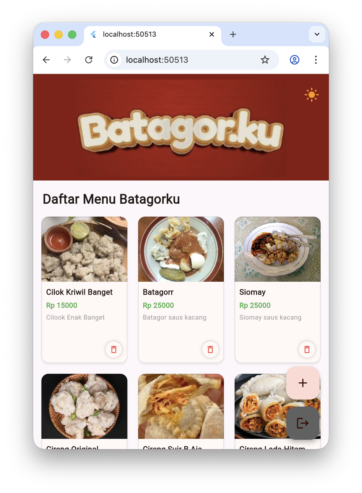
##### Tampilan utama Aplikasi Manajemen Katalog Menu Batagorku
#

#### 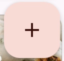
##### Fitur tambah menu.

#### 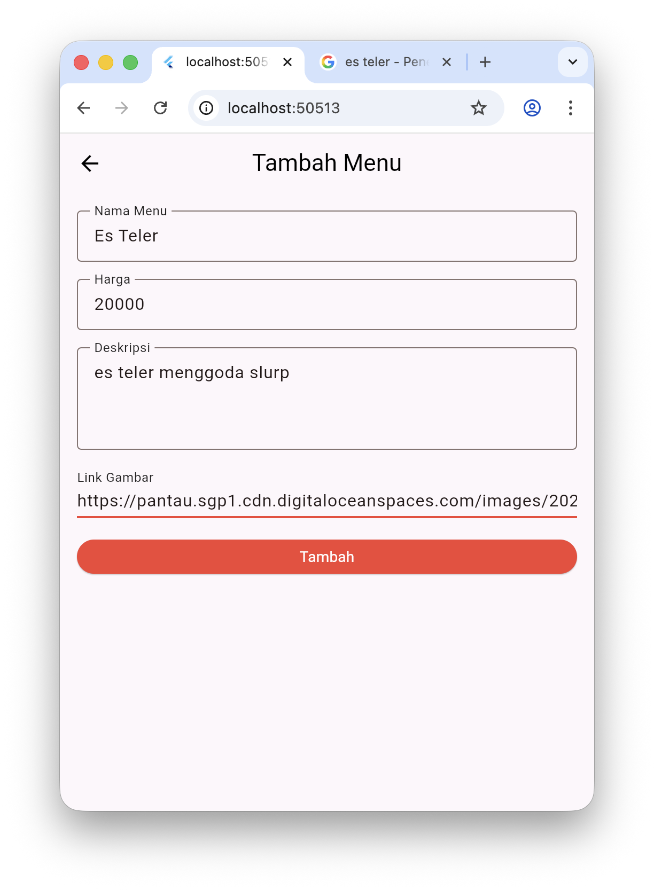
##### Disini saya menambahkan menu minuman "es teler" dengan memasukkan nama menu, harga menu, deskripsi menu, dan foto dari menu yang ingin di tambahkan.

#### 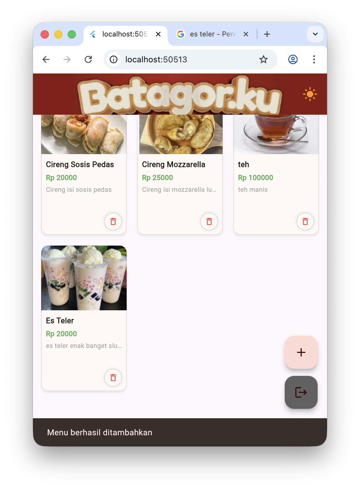
##### Menu berhasil ditambahkan.
#

#### 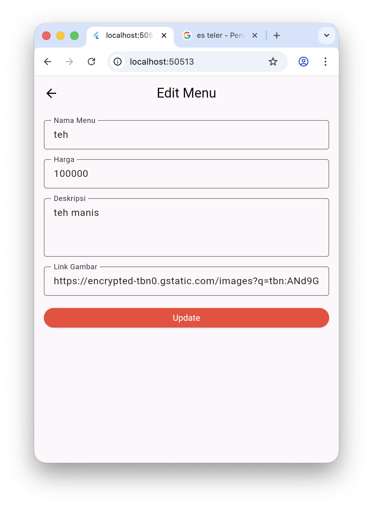
##### Fitur edit menu. Disini saya ingin mengedit harga menu cireng original. 

#### 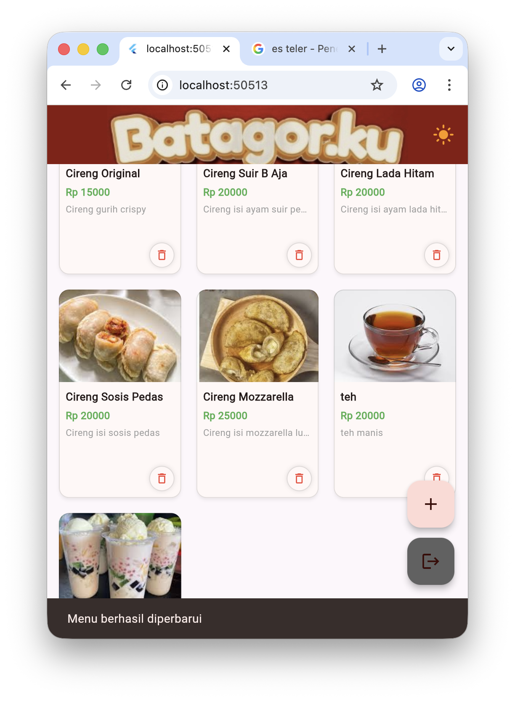
##### Harga berhasil berubah.
#

####  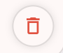
##### Fitur hapus menu.

#### 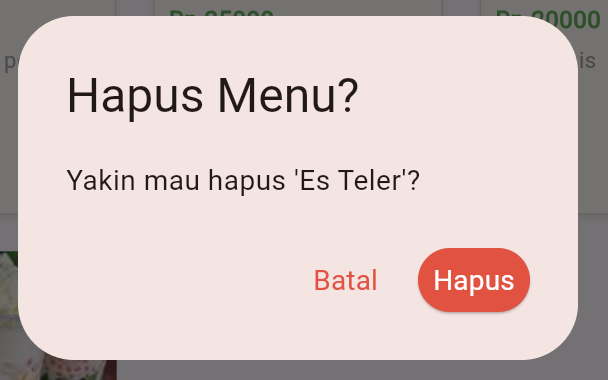
##### Saya ingin menghapus menu "es teler".

#### 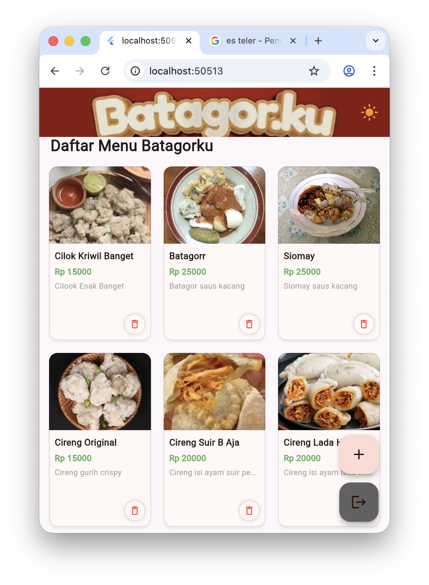
##### Menu berhasil terhapus.
#

## Nilai Tambah.

#### 
##### Tombol untuk Light/Dark Mode.

#### 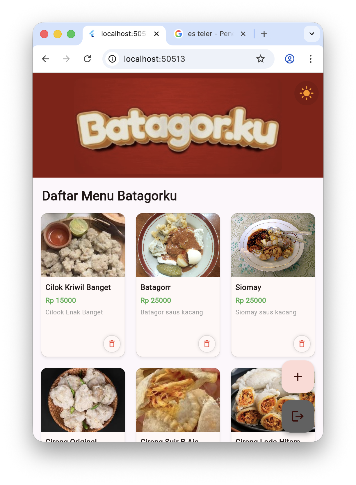
##### Tampilan saat Light Mode.

#### 
##### Tampilan saat Dark Mode.
#

#### 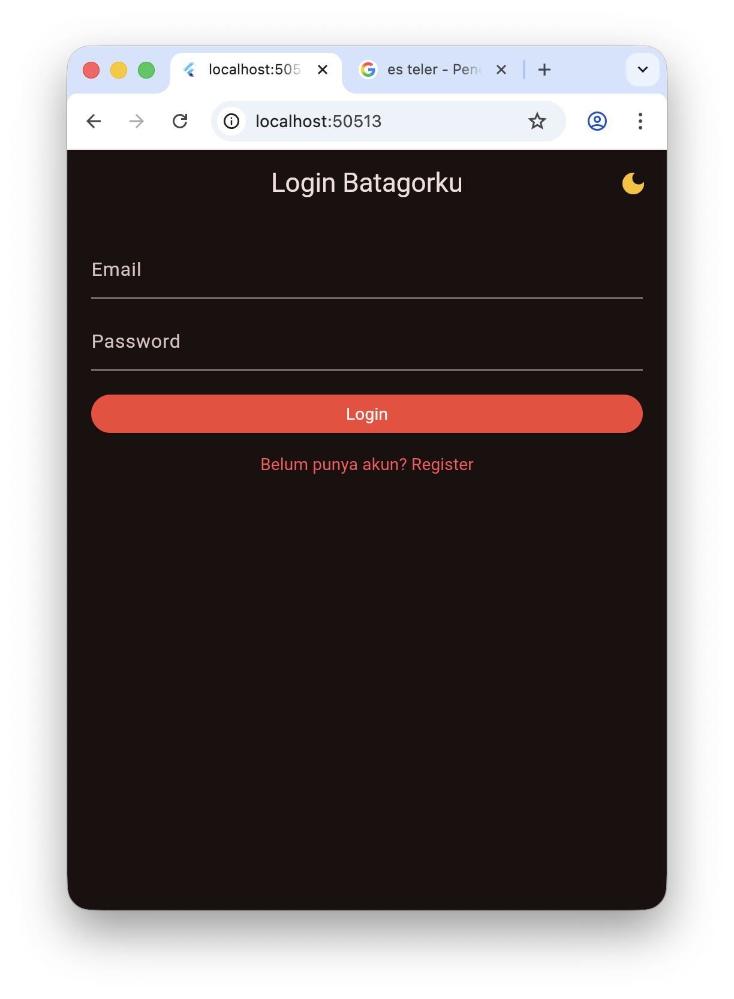
##### Tampilan halaman Login.

#### 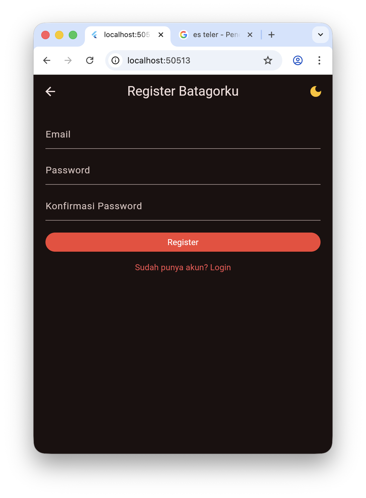
##### Tampilan halaman Register.

#### 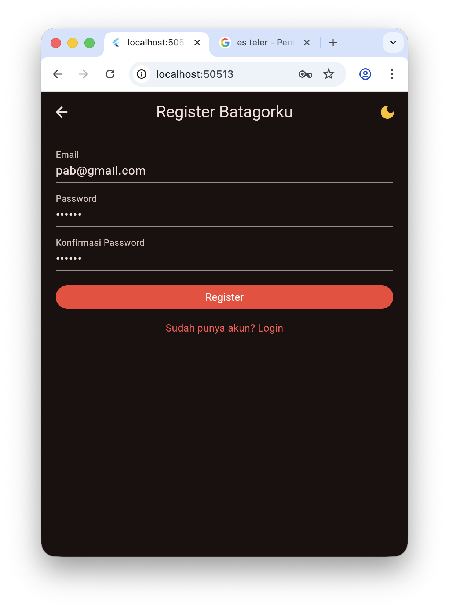
##### Saya mencoba membuat akun baru dengan memasukkan email dan password.

#### 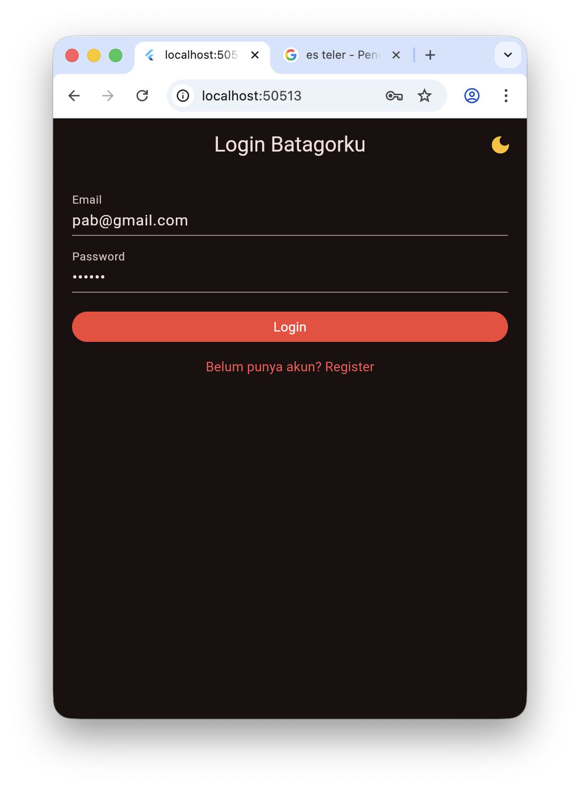
##### Dan saya mencoba untuk login dengan akun yang sudah dibuat sebelumnya.

#### 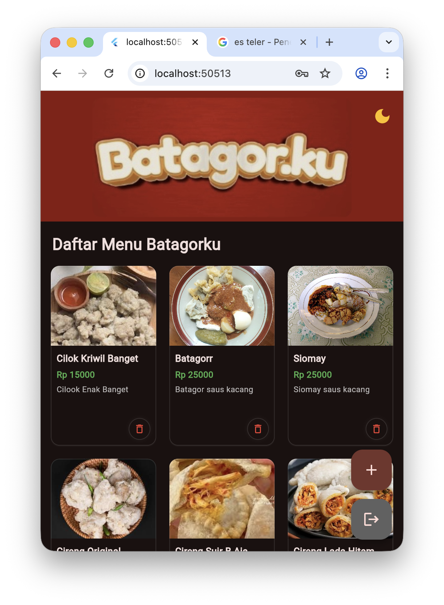
##### Dan saya berhasil login dengan akun yang sudah di register sebelumnya.
#

## Widget yang Digunakan

- MaterialApp
- Scaffold
- AppBar
- Text
- TextField
- TextFormField
- Form
- Column
- Padding
- SizedBox
- ElevatedButton
- TextButton
- IconButton
- FloatingActionButton
- SnackBar
- AlertDialog
- CustomScrollView
- SliverAppBar
- SliverGrid
- Card
- GestureDetector
- Container
- Image.asset
- Image.network
- Center
- CircularProgressIndicator
